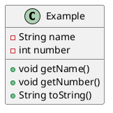

---
title: Cgroup
categories: 
- Linux
tags:
- Linux Cgroup
---

```plantuml
@startuml
  class Example {
    - String name
    - int number 
    
    +void getName()
    +void getNumber()
    +String toString()
  }
@enduml
```